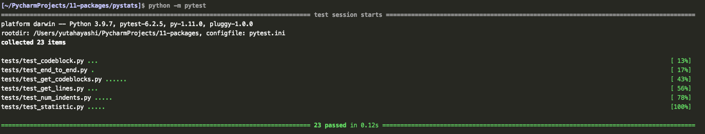

# Capstone: Final Project, Part-3

### About the Program

`PyStatsApp` is a command line interface that analyzes Python packages and modules. 
When this script is done with analyzing, it will generate the statistics of each script.

### Additional Features from the previous project-2

- In `pystats.py`, new statistic named `dunderMethodPythonPackage` has been added. This will collect the statistics of 
each dunder methods such as `__init__`, `__str__` etc.
- Inside `report.py`, some new lines are added in `write_report` function to enable the analyzer for the packages

### How to Run

This program is designed to work for both single python module or package.

1. If you run one specified module,

  `$  python -m pystats statistic.py`

2. If you run multiple specified module, 

  `$  python -m pystats statistic.py reports.py`

3. If you run a directory,

  `$  python -m pystats pystats`

This will generate a report file `out.md`

### Test Functions

- All the test functions are within `pystats/tests` directories.
There are 5 functions added under `test_statistic.py`
  - `test_num_module_lines`: test function for to test `statistic.NumModuleLines`
  - `test_num_func_lines`: test function for to test `statistic.NumFuncLines`
  - `test_num_method_lines`: test function for to test `statistic.NumMethodLines`
  - `test_num_class_lines`: test function for to test `statistic.NumClassLines`
  - `test_dunder_method`: test function for to test `statistic.dunderMethodPythonPackage`

